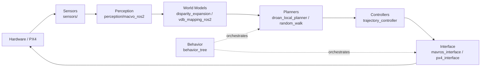
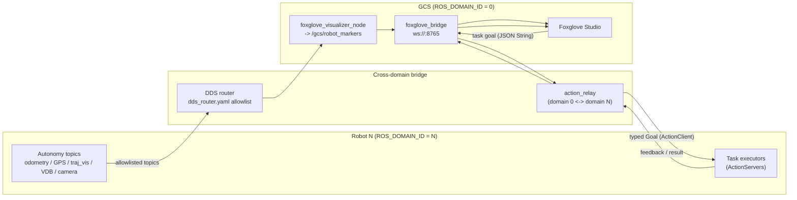

# AirStack Documentation

Practical operator + developer notes for running and understanding [AirStack](https://github.com/castacks/AirStack) (AirLab, CMU) — a layered autonomous aerial robotics stack on ROS 2, Docker, and Isaac Sim (Pegasus + PX4 SITL).

> File paths in this document are relative to the **AirStack repo root** (e.g. `~/AirStack`), not this documentation repo.

## Contents

- [Quick Start](#quick-start)
- [Open the Visualizer in Foxglove](#open-the-visualizer-in-foxglove)
- [Reset Isaac Sim Without Restarting AirStack](#reset-isaac-sim-without-restarting-airstack)
- [AirStack Architecture](#airstack-architecture)
- [Ground Control Station, Drone & Sensors](#ground-control-station-drone--sensors)
- [ROS 2 Topics](#ros-2-topics)
- [Configuration Files](#configuration-files)
- [Troubleshooting](#troubleshooting)

---

## Quick Start

**1. Start Docker**

```bash
sudo systemctl start docker
```

**2. Check Docker status (optional)**

```bash
docker info
```

**3. Bring up AirStack**

```bash
cd AirStack
airstack up
```

This launches the robot, the Ground Control Station (GCS), and Isaac Sim.

**4. Shut AirStack down**

```bash
airstack down
```

---

## Open the Visualizer in Foxglove

AirStack uses **Foxglove Studio** as its default visualizer (not RViz in this version). After `airstack up`, a Foxglove window opens but starts with no layout and no live connection — load the layout and connect:

1. Click the **top-left icon** (the Foxglove menu).
2. Click **"Layouts"**.
3. Click **"+ Add"**.
4. Click **"Import Personal Layout"**.
5. Select the layout file **`airstack_layout_num_robots_1.json`** (matches `NUM_ROBOTS=1`; for N robots, pick the `_num_robots_<N>` file). It is generated inside the GCS container at `/root/` on every startup.
6. Open the selected file in the dialog.
7. Click the **top-left icon** again.
8. Click **"Open connection"**.
9. In the **Foxglove WebSocket** row, confirm the address bar shows `ws://localhost:8765` and click **Open**.
   - Use `ws://localhost:8765` when Foxglove runs **inside** the GCS container.
   - Use `ws://localhost:8766` when Foxglove runs on the **host**.

You should now see the drone and live data in the visualizer.

**To refresh Foxglove** (e.g. after restarting the sim): re-open the connection (steps 7–9), or hard-reload the window with **`Ctrl+R`** (your imported layout is preserved).

---

## Reset Isaac Sim Without Restarting AirStack

If only the simulator misbehaves (e.g. PX4 died), you don't need to tear down the whole stack. From lightest to heaviest:

**Option 1 — Stop → Play in the Isaac Sim GUI (lightest).**
In Pegasus, PX4's lifecycle is tied to the simulation timeline: pressing **Stop** kills the stale PX4 and closes the MAVLink link; pressing **Play** re-initializes the link and **auto-relaunches a fresh PX4**. Try this first. (If the backend is already wedged mid-crash, this may not recover — escalate.)

**Option 2 — Restart just the Isaac Sim container.**

```bash
docker restart isaac-sim
```

Because `AUTOLAUNCH="true"`, this re-runs the launch script and spawns a fresh PX4. MAVROS on the robot reconnects automatically. The robot and GCS containers keep running.

**Option 3 — Full clean restart (most reliable).**

```bash
cd AirStack
airstack down
airstack up
```

> **Note:** There is no first-class "restart PX4 only" command, and the Pegasus MAVLink backend has no auto-reconnect logic. Relaunching only the PX4 binary by hand will **not** restore telemetry — use one of the options above.

After restarting, verify before commanding flight:

```bash
# PX4 alive (should show a running px4, NOT "<defunct>")
docker exec isaac-sim bash -lc 'pgrep -af px4'

# Odometry flowing (want a steady Hz, not "no new messages")
docker exec airstack-robot-desktop-1 bash -lc \
  'source /root/AirStack/robot/ros_ws/install/setup.bash && \
   timeout 5 ros2 topic hz /robot_1/odometry_conversion/odometry'
```

---

## AirStack Architecture

AirStack is organized as a set of Docker containers wired onto one custom bridge network, running a layered ROS 2 (Jazzy) autonomy stack. Each robot lives on its own DDS domain, and a cross-domain bridge surfaces fleet state to a Foxglove-based Ground Control Station.

### Component Containers

The top-level `docker-compose.yaml` includes one compose file per component and defines the shared bridge network:

| Service | Compose file | Role |
|---|---|---|
| **robot** (`robot-desktop`, plus `-onboard`/`-offboard`, `robot-voxl`, `robot-l4t`) | `robot/docker/docker-compose.yaml` | The onboard ROS 2 Jazzy autonomy stack. `robot-desktop` is the dev/sim profile (x86 + GPU, launches `desktop_bringup` with `AUTONOMY_ROLE=full`). Scaled to multiple robots via `deploy.replicas: ${NUM_ROBOTS}`. Variants cover Jetson (`robot-l4t`), VOXL (`robot-voxl`), and split onboard/offboard deployments. |
| **isaac-sim** | `simulation/isaac-sim/docker/docker-compose.yaml` | NVIDIA Isaac Sim with the Pegasus extension and PX4 SITL. Pinned to the static address `172.31.0.200` on the bridge network so robots can reach it deterministically. Runs a launch script (e.g. `example_one_px4_pegasus_launch_script.py`). |
| **gcs** (`gcs`, `gcs-real`) | `gcs/docker/docker-compose.yaml` | Ground Control Station. Runs the GCS bringup (`gcs.launch.xml`): `foxglove_bridge`, the GCS visualizer, and the action relay. Operates on `ROS_DOMAIN_ID=0` and bridges to each robot's domain. |
| **docs** | `docs/docker/docker-compose.yaml` | Live MkDocs documentation server on port `8000`. |

All services attach to the **custom bridge network `airstack_network` (subnet `172.31.0.0/24`)** defined in the top-level compose file, isolating inter-container traffic from other Docker networks on the host. (Field-deployment profiles such as `gcs-real`, `robot-l4t`, and `robot-voxl` instead use `network_mode: host`.)

### Layered Autonomy Stack

The onboard stack under `robot/ros_ws/src/` follows a strict layered data flow. Each layer is a directory containing individual algorithm modules plus a `*_bringup` package that wires them together with topic remapping:

```
Sensors → Perception → World Models → Planners → Controllers → Interface → Hardware
```

| Layer | What it does | Source dir / reference module |
|---|---|---|
| **Sensors** | Acquires raw sensor data (LiDAR, stereo, gimbal) and publishes it on standard topics | `sensors/` — e.g. `lidar_point_cloud_filter` |
| **Perception** | State estimation and visual processing (e.g. visual odometry) | `perception/` — `macvo_ros2` |
| **World Models** | Builds local and global obstacle/occupancy representations | local: `local/world_models/disparity_expansion`, global: `global/world_models/vdb_mapping_ros2` |
| **Planners** | Local (reactive) and global (mission-scale) path planning | local: `local/planners/droan_local_planner`, global: `global/planners/random_walk` |
| **Controllers** | Converts planned trajectories into control commands | `local/controls/trajectory_controller` (also `attitude_controller`, `pid_controller`) |
| **Interface** | Hardware/flight-controller bridge (MAVROS/PX4) and safety | `interface/` — `mavros_interface`, `px4_interface`, `robot_interface` |
| **Hardware** | Flight controller / vehicle (or PX4 SITL in Isaac Sim) | PX4 via the interface layer |
| **Behavior** (orchestration) | High-level mission execution driving the layers above via behavior trees and task executors | `behavior/` — `behavior_tree` |

Module I/O is configurable via launch-file remapping, so algorithm implementations can be swapped without touching downstream layers. The bringup variant is selected by `AUTONOMY_ROLE` (`full` | `onboard` | `offboard`) in `autonomy_bringup/launch/robot.launch.xml`.



### Multi-Domain / DDS Architecture

Each robot runs on its **own `ROS_DOMAIN_ID`** so robots are isolated DDS partitions by default — **robot N → domain N**. Multi-robot is achieved with Docker Compose replicas (`NUM_ROBOTS=3` → `airstack-robot-desktop-1/-2/-3`), not in-container namespacing.

**Name + domain resolution at startup.** Each container computes its identity in `robot/docker/.bashrc`: it reads `ROBOT_NAME_SOURCE` (`container_name` or `hostname`) to obtain a name, then runs `robot/docker/robot_name_map/resolve_robot_name.py` against the YAML mapping (e.g. `default_robot_name_map.yaml`). The resolver regex-matches the container/host name and exports both `ROBOT_NAME` (e.g. `robot_1`) and `ROS_DOMAIN_ID` (e.g. `1`). An explicit `ROS_DOMAIN_ID` from the environment takes precedence — this is how offboard GCS containers are forced onto domain 0.

**Crossing domains to the GCS (domain 0).** Robot topics are pinned to the robot's domain; the GCS lives on domain 0. Three mechanisms bridge them:

1. **DDS router allowlist** — `robot/ros_ws/src/autonomy_bringup/onboard_all/config/dds_router.yaml` defines two participants (`robot` on `$(env ROS_DOMAIN_ID)` and `gcs` on `$(var gcs_domain)`) and an explicit **allowlist** of topics/services that may cross (odometry, GPS, trajectory vis, VDB map, camera/LiDAR streams, behavior-tree services). Only allowlisted topics traverse domains; the router re-reads its allowlist only at startup. (Gossip peer profiles are bridged separately on domain 99.)
2. **action_relay** — `gcs/ros_ws/src/action_relay` bridges *actions* (not just topics). Because `foxglove_bridge` drops nested fields when calling action services, the relay subscribes to plain `String`/JSON command topics on domain 0, rebuilds typed `Goal` messages, and forwards them via an `ActionClient` on the robot's domain N — republishing feedback/result back on domain 0. One relay node is spawned per robot. It also gates non-takeoff tasks on an "airborne" precondition and re-references global-ENU waypoints to each robot's GPS boot offset.
3. **GCS Foxglove visualizer** — `gcs/ros_ws/src/gcs_visualizer` (`foxglove_visualizer_node`) runs on domain 0 and subscribes to the bridged per-robot topics. Every 5 s it auto-discovers robots by regex-matching the topic prefix, then merges each robot's markers (mesh, trajectory, global plan, VDB map) into a single `/gcs/robot_markers` `MarkerArray`, translating each robot's local `map` frame into one global ENU frame using its GPS boot offset.



### GCS / Visualization

**Foxglove Studio is the default visualizer in this version (not RViz** — the RViz/rqt nodes in `gcs.launch.xml` are wrapped in `<?ignore ?>` blocks). The GCS bringup launches:

- **`foxglove_bridge`** on port **8765** (`address 0.0.0.0`), exposing domain-0 topics over WebSocket. Connect at `ws://localhost:8765` inside the container, or `ws://localhost:8766` from the host (port-mapped in the gcs compose service).
- **`foxglove_visualizer_node`** plus the waypoint/polygon collector and gossip-payload nodes, which produce the georeferenced fleet view and interactive editors.

A **`NUM_ROBOTS`-matched Foxglove layout is auto-generated on every container startup** by `gcs/foxglove_extensions/render_layout.py`, which expands the single-robot template `airstack_default.json` into `/root/airstack_layout_num_robots_<N>.json` (regenerated each boot, removed with the container). Import that file once per `NUM_ROBOTS` change.

---

## Ground Control Station, Drone & Sensors

### Ground Control Station (GCS)

The **Ground Control Station** is the operator-side half of AirStack — the software you use to *watch* and *command* the fleet, as opposed to the autonomy that runs *on* each drone. It runs in its own `gcs` container on `ROS_DOMAIN_ID=0` and is the only place a human (or an external client) interacts with the robots.

The GCS does **not** fly the drone itself; the onboard autonomy stack does that. The GCS's job is to bridge the operator and the per-robot DDS domains, and to provide visualization and high-level command tools. It runs:

- **Foxglove Studio + `foxglove_bridge`** (port 8765) — the visualization front-end. This is the default visualizer in this version of AirStack (RViz is disabled). See [Open the Visualizer in Foxglove](#open-the-visualizer-in-foxglove).
- **`foxglove_visualizer_node`** — discovers each robot's bridged topics and merges them into one georeferenced fleet view (`/gcs/robot_markers`) in a shared global ENU frame.
- **`action_relay`** — translates the JSON commands sent from Foxglove panels into typed ROS 2 action goals on each robot's domain (takeoff, navigate, etc.), and relays feedback/results back.
- **Waypoint & polygon editors** — interactive click-to-place tools for building routes and geofence/search areas.

Because each robot lives on its own DDS domain, the GCS reaches them through the cross-domain bridge (DDS router + action relay) described in [Multi-Domain / DDS Architecture](#multi-domain--dds-architecture). A field variant, `gcs-real`, runs the same software in host-network mode for deployment on a real ground laptop.

### Drone Model

The default simulated vehicle is the **Pegasus Simulator Iris quadrotor** running **PX4 SITL**.

| Property | Value |
|---|---|
| Airframe | **Iris quadrotor** (4 rotors), Pegasus Simulator asset |
| Autopilot / firmware | **PX4 SITL** (auto-launched by Pegasus, MAVLink lockstep) |
| Simulator | NVIDIA Isaac Sim + **Pegasus Simulator** extension |
| Drone USD (sim model) | Pegasus `assets/Robots/Iris/iris.usd` |
| ROS URDF (frames/TF) | `common/ros_packages/robot_descriptions/iris/urdf/iris_with_sensors.pegasus.robot.urdf` (set via `URDF_FILE` in `.env`) |
| MAVLink port | `14540 + vehicle_id` (e.g. `14541` for robot_1) |
| Default launch script | `example_one_px4_pegasus_launch_script.py` (single drone) |

The drone's kinematic tree (from the URDF) is: `base_link` → body → 4 rotors, plus a LiDAR mount (`ouster`) and a ZED camera body (`camera_left` / `camera_right` / `imu`). To fly a different airframe you change the drone USD in the launch script **and** the `URDF_FILE` — see [Adding / Changing a Drone or Sensors](#adding--changing-a-drone-or-sensors).

### Onboard Sensors

Two of the drone's sensors are **simulated by Isaac Sim** (the ZED stereo camera and the Ouster LiDAR); the rest (IMU, GPS, barometer/altitude) come from **PX4's flight controller via MAVROS**, not from a separate ROS driver. Sensor mounting offsets and configs are set in the launch script.

| Sensor | Model / Config | Measures | ROS 2 topic(s) | Type | Notes |
|---|---|---|---|---|---|
| **Stereo camera** | Stereolabs **ZED X** (Isaac asset) | Rectified RGB (left & right) + ground-truth depth | `…/sensors/front_stereo/{left,right}/image_rect`, `…/{left,right}/camera_info`, `…/right/depth_ground_truth` | `sensor_msgs/Image`, `CameraInfo` | Mounted forward, offset `[0.2, 0.0, −0.05]` m. Default resolution **480×300** (extension default). `depth_ground_truth` is **sim-only** ground truth, not a real stereo depth estimate. |
| **LiDAR** | **Ouster OS1** (`ouster_os1`; 128-ch, 10 Hz, 512 res) | 3D point cloud | `…/sensors/ouster/point_cloud` (filtered; raw is `…/point_cloud_raw`) | `sensor_msgs/PointCloud2` | Offset `[0.0, 0.0, 0.025]` m, `min_range = 0.75` m. **Always enabled** in the single-drone script; in the *multi*-drone script it is gated by `ENABLE_LIDAR`. |
| **IMU (flight controller)** | PX4 SITL EKF | Body acceleration, angular rate, orientation | `…/interface/mavros/imu/data` | `sensor_msgs/Imu` | From **PX4 via MAVROS** (robot domain only). This is the IMU the EKF fuses. |
| **GPS** | PX4 SITL (simulated GPS → EKF) | Global position (lat/lon/alt) | `…/interface/mavros/global_position/global` | `sensor_msgs/NavSatFix` | From **PX4 EKF via MAVROS**. Bridged to the host/GCS domain. The GCS uses the first fix as the robot's ENU boot origin. |
| **Barometer / altitude** | PX4 SITL | Altitude (AMSL / relative / terrain) | `…/interface/mavros/altitude` | `mavros_msgs/Altitude` | From **PX4 EKF via MAVROS** (robot domain only). |

> **Note — there is also a ZED *camera* IMU frame** (`imu` link under the ZED body) in the URDF, but the default launch graph does not publish it as a ROS topic — only the flight-controller IMU above is live. The `/sim/overhead/image` topic you may see is a **world/scene overhead camera for visualization, not a sensor on the drone.**

> Most onboard-sensor topics are **robot-domain-only** (not visible from your host terminal by default) — see [Viewing topics across DDS domains](#viewing-topics-across-dds-domains).

---

## ROS 2 Topics

Robot-scoped topics are namespaced under `/{robot_name}` (e.g. `/robot_1`); GCS topics live under `/gcs`. In a multi-robot deployment each robot runs on its own `ROS_DOMAIN_ID`, and the GCS bridges per-robot topics across domains.

> **Frames:** Each robot publishes its autonomy data in its own local `map` frame (origin = the drone's boot/takeoff position). The GCS visualizer georeferences these into a single shared global ENU `map` frame using each robot's first GPS fix as a boot offset.

### Viewing topics across DDS domains

AirStack isolates each robot on its own `ROS_DOMAIN_ID` (**robot N → domain N**); the GCS and your host terminal are on **domain 0**. A `ros2 topic list` run on the host therefore shows **only the topics the DDS router bridges to domain 0** — most `mavros/*` topics (e.g. `local_position/odom`, `local_position/pose`, `imu/data`, `estimator_status`) are **not** bridged and won't appear, even though they exist and publish on the robot domain.

To view a robot-domain-only topic (e.g. the raw onboard EKF), use any of:

```bash
# (a) The bridged canonical odometry — works from the host as-is (domain 0)
ros2 topic echo /robot_1/odometry_conversion/odometry

# (b) Run ros2 inside the robot container (it's already on the robot domain)
docker exec airstack-robot-desktop-1 bash -lc \
  'source /root/AirStack/robot/ros_ws/install/setup.bash; \
   ros2 topic echo /robot_1/interface/mavros/local_position/odom'

# (c) From the host, switch your terminal onto the robot's domain
ROS_DOMAIN_ID=1 ros2 topic list | grep local_position
ROS_DOMAIN_ID=1 ros2 topic echo /robot_1/interface/mavros/local_position/pose
```

Use **(b)** if your host has no matching ROS 2 environment sourced — the container always has the right setup. With **(c)**, reset to `ROS_DOMAIN_ID=0` afterward to get the GCS/bridged topics back. Which topics cross to domain 0 is defined by the allowlist in `robot/ros_ws/src/autonomy_bringup/onboard_all/config/dds_router.yaml`.

### 1. Pose & State Estimation (Onboard EKF)

The estimation chain is: **PX4 onboard EKF2 → MAVROS → `odometry_conversion` → autonomy stack.** PX4's EKF2 fuses IMU/GPS/baro onboard and exposes its estimate over MAVLink; the MAVROS `local_position` plugin converts it to ENU and publishes it (already in the `map`→`base_link` frame) on `/{robot}/interface/mavros/local_position/odom`. The `odometry_conversion` node subscribes to that topic directly and re-publishes it as **`/{robot}/odometry_conversion/odometry`** — the **canonical AirStack odometry** that every autonomy module (planners, controllers, takeoff/landing, safety monitor) consumes via the remapped `odometry` topic.

> **Raw mavros odom vs. converted odom — what actually differs.** Both topics carry the *same* PX4 EKF estimate (identical position, orientation, velocity, and timestamp). `odometry_conversion` is a thin republisher, not a separate estimator. In this MAVROS-based deployment the only real differences are:
> - **QoS:** the mavros topic is `BEST_EFFORT`; the converted topic is `RELIABLE` (so the autonomy stack receives every sample). This is the node's main purpose.
> - **TF:** `odometry_conversion` also broadcasts the dynamic transforms `map→base_link` and `map→base_link_stabilized`; mavros does not publish TF.
> - The frame IDs are already `map`/`base_link` on the mavros topic (set in `px4_config.yaml`), so the node's frame "overwrite" is effectively a no-op here.
>
> **Covariance is unpopulated.** The pose/twist covariance is **all zeros on both topics** — PX4's EKF2 does not fill the covariance fields of the MAVLink ODOMETRY message in this setup. Neither topic provides EKF uncertainty; to get real covariance you must enable it upstream (PX4 / MAVLink odometry).
>
> **Note (legacy uXRCE-DDS path):** an alternate interface (`px4_interface.launch.xml`) exists in the repo that adds a `/{robot}/interface/odometry` hop, but it is **not** what runs by default. The default stack uses MAVROS via `interface_bringup/launch/interface.launch.py`, and there is no `/{robot}/interface/odometry` topic in a default deployment.

> **Visibility column:** **Host** = bridged to the GCS/host domain (`ROS_DOMAIN_ID=0`) by the DDS router, so it appears in `ros2 topic list` on your laptop. **Robot only** = lives on the robot's domain (`ROS_DOMAIN_ID=N`) and is **not** bridged — it exists and publishes, but you must be on the robot domain to see it (see [Viewing topics across DDS domains](#viewing-topics-across-dds-domains)).

| Topic | Type | Purpose | Visibility | Notes |
|---|---|---|---|---|
| `/{robot}/interface/mavros/local_position/odom` | `nav_msgs/Odometry` | PX4 onboard EKF pose + twist estimate as exposed by MAVROS | **Robot only** | Raw MAVROS output; BEST_EFFORT QoS. Frame `map`→`base_link`. Upstream source of AirStack odometry. |
| `/{robot}/interface/mavros/local_position/pose` | `geometry_msgs/PoseStamped` | PX4 EKF pose only (no twist) | **Robot only** | Pose-only view of the same EKF estimate. |
| `/{robot}/odometry_conversion/odometry` | `nav_msgs/Odometry` | **Canonical AirStack odometry** used by the whole autonomy stack | **Host** | Frame `map` → child `base_link`; RELIABLE QoS; also broadcast to TF. Modules subscribe to this (remapped to `odometry`). Source for the GCS pose arrow. Numerically identical to the raw mavros odom. |
| `/{robot}/interface/mavros/imu/data` | `sensor_msgs/Imu` | Orientation + angular velocity + linear acceleration from the flight-controller IMU | **Robot only** | Feeds PX4 EKF; available to perception/VIO. |
| `/{robot}/interface/mavros/estimator_status` | `mavros_msgs/EstimatorStatus` | **PX4 EKF health/status flags** (attitude, velocity, position validity, etc.) | **Robot only** | Use to check estimator health. |
| `/{robot}/interface/mavros/global_position/global` | `sensor_msgs/NavSatFix` | GPS global position (lat/lon/alt) | **Host** | The GCS uses the first valid fix as the robot's ENU "boot" origin; `action_relay` gates non-takeoff tasks on its altitude. |
| `/{robot}/interface/mavros/altitude` | `mavros_msgs/Altitude` | PX4 altitude estimates (AMSL, relative, terrain) | **Robot only** | |
| `/{robot}/interface/mavros/state` | `mavros_msgs/State` | FCU connection/armed/mode (e.g. OFFBOARD) state | **Robot only** | |
| `/{robot}/interface/mavros/extended_state` | `mavros_msgs/ExtendedState` | Landed state (ON_GROUND / IN_AIR) and VTOL state | **Robot only** | Takeoff/landing task uses `landed_state` to confirm airborne/landed. |
| `/{robot}/interface/mavros/battery` | `sensor_msgs/BatteryState` | Battery voltage / percentage | **Robot only** | |
| `/{robot}/behavior/drone_safety_monitor/state_estimate_timed_out` | `std_msgs/Bool` | Watchdog: true if odometry stopped arriving within the timeout | **Robot only** | Published at 1 Hz by `drone_safety_monitor`, which watches `odometry_conversion/odometry`. On timeout it auto-pauses the trajectory controller; the takeoff task rejects new goals while true. |

> Most `mavros/*` topics are **robot-domain-only** by default — only `odometry_conversion/odometry` and `mavros/global_position/global` from this group are bridged to the host. If you don't see a topic in `ros2 topic list` on your laptop, it almost certainly exists on the robot domain; see below.

### 2. Commanding the Drone / Waypoints & Tasks

High-level commands are issued as **ROS 2 actions** under `/{robot}/tasks/{task}`. Because `foxglove_bridge` drops nested fields when calling action services, the GCS does **not** call the actions directly: the Foxglove panels publish a JSON `std_msgs/String` on `…/goal` (and `…/cancel`), and the `action_relay` node parses the JSON into the typed Goal and forwards it to the on-robot action server, streaming `…/relay_feedback` and `…/relay_result` back as JSON Strings. The relay also transforms global-ENU coordinates from the editors into the robot's local `map` frame (subtracting the GPS boot offset) and rejects every non-takeoff task unless the drone is ≥ 5 m AGL.

Tasks: `takeoff`, `land`, `navigate`, `exploration`, `semantic_search`, `fixed_trajectory`.

| Topic | Type | Purpose | Notes |
|---|---|---|---|
| `/{robot}/tasks/{task}/goal` | `std_msgs/String` (JSON) | Send a task goal from the GCS | Parsed by `action_relay` into the typed action goal. |
| `/{robot}/tasks/{task}/cancel` | `std_msgs/String` | Cancel the active task | Relay forwards a cancel to the robot's action server. |
| `/{robot}/tasks/{task}/relay_feedback` | `std_msgs/String` (JSON) | Live task feedback re-published by the relay | Mirrors the action feedback fields. |
| `/{robot}/tasks/{task}/relay_result` | `std_msgs/String` (JSON) | Final result (`{success, message}`) | Also used to surface rejections (e.g. "takeoff first"). |
| `/{robot}/tasks/{task}` (action) | `task_msgs/action/{Task}Task` | Underlying ROS 2 action server on the robot | e.g. `TakeoffTask`, `LandTask`, `NavigateTask`, `ExplorationTask`, `SemanticSearchTask`, `FixedTrajectoryTask`. |
| `/{robot}/global_plan` | `nav_msgs/Path` | Global waypoint path the local planner follows | Consumed by the navigate task / local planner (remapped to `global_plan`). |

**Goal fields** (from the `action_relay` builders and the `task_msgs` `.action` files):

| Task | Key goal fields |
|---|---|
| `takeoff` | `target_altitude_m` (float, absolute target altitude; must be > 0), `velocity_m_s` (float; 0 = use config default) |
| `land` | `velocity_m_s` (float; 0 = use config default) |
| `navigate` | `global_plan` (`nav_msgs/Path`), `goal_tolerance_m` (float, default 1.0) |
| `exploration` | `search_bounds` (`geometry_msgs/Polygon`, empty = unbounded), `min/max_altitude_agl`, `min/max_flight_speed`, `time_limit_sec` (0 = no limit) |
| `semantic_search` | `query` (string), `background_queries` (string), `search_area` (`geometry_msgs/Polygon`), `min/max_altitude_agl`, `min/max_flight_speed`, `confidence_threshold` (default 0.95) |
| `fixed_trajectory` | `trajectory_spec` (`airstack_msgs/FixedTrajectory` — type + key/value attributes), `loop` (bool) |

**Foxglove waypoint & polygon editors** — the GCS click-to-place panels (publishing on `/clicked_point`, `geometry_msgs/PointStamped`) feed two collector nodes that maintain editable lists, named saves, and rendered markers. The waypoint editor's `…/path` output is the `nav_msgs/Path` you wire into a `navigate` goal; the polygon editor's vertices feed `exploration`/`semantic_search` areas.

| Topic | Type | Purpose | Notes |
|---|---|---|---|
| `/clicked_point` | `geometry_msgs/PointStamped` | Click in the Foxglove 3D panel to place a waypoint/vertex | Shared by both editors; each gated by an Enable toggle. |
| `/gcs/waypoints/command` | `std_msgs/String` (JSON) | Edit commands: add/delete/move/reorder/clear/set_altitude/saves | |
| `/gcs/waypoints/list` | `std_msgs/String` (JSON) | Active waypoint list for the panel | Latched. |
| `/gcs/waypoints/path` | `nav_msgs/Path` | Active waypoints as a Path, in global `map` frame | Latched. Use as the `navigate` task `global_plan`. |
| `/gcs/waypoints/markers` | `visualization_msgs/MarkerArray` | Active-editor waypoint markers | Latched. |
| `/gcs/waypoints/save_markers` | `visualization_msgs/MarkerArray` | All named saves rendered, each in its own color | Latched. |
| `/gcs/waypoints/saves` | `std_msgs/String` (JSON) | Saved-route metadata (name, color, count, vertices) | Latched. |
| `/gcs/polygon/command` | `std_msgs/String` (JSON) | Polygon edit commands (same verbs as waypoints) | |
| `/gcs/polygon/list` | `std_msgs/String` (JSON) | Active polygon vertices | Latched. |
| `/gcs/polygon/markers` | `visualization_msgs/MarkerArray` | Active polygon outline (closed loop, red) | Latched. |
| `/gcs/polygon/save_markers` | `visualization_msgs/MarkerArray` | All saved polygons, each in its own color | Latched. |
| `/gcs/polygon/saves` | `std_msgs/String` (JSON) | Saved-polygon metadata | Latched. |

### 3. GCS Visualization Topics

The single `foxglove_visualizer_node` auto-discovers each robot's GPS/odometry/trajectory/plan/VDB topics, translates them from each robot's local `map` frame into the shared global ENU `map` frame using the GPS boot offset, and merges them into one MarkerArray for Foxglove.

| Topic | Type | Purpose | Notes |
|---|---|---|---|
| `/gcs/robot_markers` | `visualization_msgs/MarkerArray` | Combined per-robot markers (body mesh, name label, axes, local trajectory, global plan, VDB map) in global ENU | One merged array for all discovered robots. |
| `/gcs/{robot}/location` | `sensor_msgs/NavSatFix` | Per-robot GPS rewritten to `frame_id='map'` | Foxglove's Map panel only accepts a fix in the `map` frame; this is the per-robot pin (e.g. `/gcs/robot_1/location`). |
| `/gcs/map_origin/location` | `sensor_msgs/NavSatFix` | Stationary fix at the configured `ORIGIN_LAT/LON` | Published at 1 Hz so the Map panel has a fixed reference point. |
| `/gcs/map_origin/ground_msl` | `std_msgs/Float64` | MSL altitude of map `z = 0` (ground datum) | Latched; set once GPS + odom are both available. |
| `/gcs/sim_ground` | `visualization_msgs/Marker` | Sim overhead-camera image rendered as a textured ground plane (TRIANGLE_LIST) | Sim only; latched, built once from `/sim/overhead/image` + `/sim/overhead/spec`. |

### 4. Sensors & Perception

Raw sensor streams live under `/{robot}/sensors/…`; processed perception products under `/{robot}/perception/…`. Image and point-cloud topics use SENSOR_QOS (BEST_EFFORT).

| Topic | Type | Purpose | Notes |
|---|---|---|---|
| `/{robot}/sensors/front_stereo/left/image_rect` | `sensor_msgs/Image` | Rectified left stereo image | Input to stereo disparity. |
| `/{robot}/sensors/front_stereo/left/camera_info` | `sensor_msgs/CameraInfo` | Left camera intrinsics/calibration | |
| `/{robot}/sensors/front_stereo/right/image_rect` | `sensor_msgs/Image` | Rectified right stereo image | |
| `/{robot}/sensors/front_stereo/right/camera_info` | `sensor_msgs/CameraInfo` | Right camera intrinsics/calibration | |
| `/{robot}/sensors/front_stereo/right/depth_ground_truth` | `sensor_msgs/Image` | Ground-truth depth (sim only) | Evaluation / optional depth-based world model. |
| `/{robot}/sensors/ouster/point_cloud` | `sensor_msgs/PointCloud2` | Ouster 3D LiDAR point cloud | Feeds mapping (e.g. VDB). |
| `/{robot}/perception/stereo_image_proc/point_cloud` | `sensor_msgs/PointCloud2` | Point cloud computed from stereo disparity | Produced by `stereo_image_proc`. |

### 5. Mapping & Plans

| Topic | Type | Purpose | Notes |
|---|---|---|---|
| `/{robot}/vdb_mapping/vdb_map_visualization` | `visualization_msgs/Marker` | VDB occupancy map mesh for visualization | Per-robot; georeferenced into `/gcs/robot_markers` by the GCS. |
| `/{robot}/trajectory_controller/trajectory_vis` | `visualization_msgs/MarkerArray` | The trajectory currently being executed by the controller | Rendered as the live trajectory on the GCS. |
| `/{robot}/global_plan` | `nav_msgs/Path` | Global waypoint path the robot is following | Output of global planning / input to the navigate task and local planner. |

### 6. Common / Infrastructure Topics

| Topic | Type | Purpose | Notes |
|---|---|---|---|
| `/clock` | `rosgraph_msgs/Clock` | Simulation time | Present when `use_sim_time` is active. |
| `/tf_static` | `tf2_msgs/TFMessage` | Static transforms (e.g. `world`→`map`, sensor mounts) | Dynamic TF (`/tf`) is broadcast by `odometry_conversion`. |
| `/rosout` | `rcl_interfaces/Log` | Aggregated node logging | |
| `/parameter_events` | `rcl_interfaces/ParameterEvent` | Parameter change notifications | |
| `/gossip/peers` | custom AirStack peer-profile message | Multi-robot peer discovery / gossip payload exchange | Used by the coordination/gossip layer. |

> **Quick reference:**
> - **Drone pose / onboard EKF:** `/{robot}/interface/mavros/local_position/odom` (raw MAVROS) and the canonical `/{robot}/odometry_conversion/odometry` (used by the stack).
> - **EKF health:** `/{robot}/interface/mavros/estimator_status`.
> - **Send waypoints:** build a path with the Foxglove waypoint editor (`/gcs/waypoints/path`), then send a `navigate` goal on `/{robot}/tasks/navigate/goal`.

---

## Configuration Files

AirStack is configured almost entirely through a single top-level `.env` file (consumed by Docker Compose for variable interpolation) plus a small set of per-component config files.

| Config File (path) | Purpose | Multi-robot? | Different drone/sensors? |
|---|---|---|---|
| `.env` | Master env file. Sets Docker Compose interpolation vars (image tags, profiles, robot count, Isaac Sim launch mode/script, URDF, ports). | **Yes** — set `NUM_ROBOTS`, switch `ISAAC_SIM_SCRIPT_NAME` to the multi script. | **Yes** — point `URDF_FILE` and `ISAAC_SIM_GUI` at the right model/scene. |
| `docker-compose.yaml` | Top-level compose; `include:`s all component compose files and defines the `airstack_network` bridge (`172.31.0.0/24`). | Rarely | No |
| `robot/docker/docker-compose.yaml` | Defines all robot services. Implements `deploy.replicas: ${NUM_ROBOTS:-1}` and per-service `AUTONOMY_ROLE` + `LAUNCH_PACKAGE`. | **Yes (indirectly)** — `replicas` driven by `NUM_ROBOTS`; ports already support up to 21 robots. | Only when adding a new hardware/sensor-driver service. |
| `robot/docker/robot_name_map/default_robot_name_map.yaml` | Regex rules mapping container/host name → `ROBOT_NAME` and `ROS_DOMAIN_ID` (first match wins). | **Usually no** — default rule auto-assigns `robot_<N>`/domain `<N>`. | No |
| `robot/docker/robot_name_map/resolve_robot_name.py` | Applies the YAML rules at startup; selects input via `ROBOT_NAME_SOURCE` (`container_name`/`hostname`). | No (mechanism) | No |
| `robot/ros_ws/src/autonomy_bringup/onboard_all/config/dds_router.yaml` | Cross-domain allowlist (eProsima DDS Router) bridging robot domain ↔ GCS domain. Topics namespaced `rt/$(env ROBOT_NAME)/...`. | No — templated per robot. | **Yes** — add a line per new topic to expose to the GCS. |
| `robot/ros_ws/src/autonomy_bringup/onboard_local_offboard_global/config/dds_router.yaml` | Split-config variant; `extends` `onboard_all` and adds onboard/offboard bridge topics. | No | **Yes** (split onboard/offboard role) |
| `robot/ros_ws/src/autonomy_bringup/onboard_local_offboard_global/config/domain_bridge.yaml` | `domain_bridge` config for the split; relays `global_plan` from `gcs_domain` to the robot's domain. | No | Only if new topics must cross the onboard/offboard boundary. |
| `simulation/isaac-sim/launch_scripts/example_one_px4_pegasus_launch_script.py` | **Single-drone** Isaac Sim/Pegasus launcher. Hard-codes `robot_1`, `vehicle_id=1`, `domain_id=1`, ZED camera + RTX Ouster lidar. | **No — use the multi script.** | **Yes** — edit `DRONE_USD`, camera/lidar offsets, `lidar_config`. |
| `simulation/isaac-sim/launch_scripts/example_multi_px4_pegasus_launch_script.py` | **Multi-drone** launcher parametrized by `NUM_ROBOTS`. Loops `spawn_drone(i)` → `robot_<i>`, `vehicle_id=i`, `domain_id=i`. Honors `ENABLE_LIDAR`, `ISAAC_SIM_HEADLESS`, `PLAY_SIM_ON_START`. | **Yes — set `ISAAC_SIM_SCRIPT_NAME` to this.** | **Yes** — same drone/sensor knobs as single script. |
| `gcs/foxglove_extensions/airstack_default.json` | Foxglove layout **template** (canonical `robot_1` tab). | Edit only to change the per-robot layout. | Add panels/topics here for new sensors. |
| `gcs/foxglove_extensions/render_layout.py` | Regenerates the layout with one tab per robot from the template, driven by `NUM_ROBOTS`. Runs at GCS startup → `/root/airstack_layout_num_robots_<N>.json`. | **Yes (automatic)** — re-import the generated file. | No |
| `gcs/docker/gcs-base-docker-compose.yaml` | GCS container; runs `install.py` then `render_layout.py` at startup; sets `NUM_ROBOTS`. | Inherits `NUM_ROBOTS` automatically. | No |
| `robot/ros_ws/src/autonomy_bringup/launch/robot.launch.xml` | Single entry point for all robot deployments. Dispatches on `role` (`AUTONOMY_ROLE`); pushes `$(env ROBOT_NAME)` namespace; loads URDF via `URDF_FILE`; wires DDS router + gossip. | No (templated) | **Yes** — `urdf_file` defaults to `$(env URDF_FILE)`. |
| `robot/ros_ws/src/behavior/behavior_bringup/launch/behavior.launch.xml` | Behavior layer bringup; runs `drone_safety_monitor` with tunable `state_estimate_timeout` (default `1.0` s) watchdog on odometry. | No | Tune `state_estimate_timeout` if state estimate runs at a different rate. |
| `robot/ros_ws/src/interface/interface_bringup/launch/px4_config.yaml` | MAVROS/PX4 interface config. | No | **Yes** if the flight controller / MAVLink setup differs. |
| `common/ros_packages/robot_descriptions/iris/urdf/iris_with_sensors.pegasus.robot.urdf` | ROS-side URDF (default `URDF_FILE`) describing links + sensor frames for `robot_state_publisher`/TF. | No | **Yes** — edit/replace to change the model or sensor frames. |

### Key `.env` Variables

| Variable | Example value | What it does |
|---|---|---|
| `PROJECT_NAME` | `airstack` | Docker repo name / image tag component. |
| `VERSION` | `0.18.0` | Image tag version. |
| `DOCKER_IMAGE_BUILD_MODE` | `dev` | `dev` = mounted code built live; `prebuilt` = ros_ws baked into image. |
| `PROJECT_DOCKER_REGISTRY` | `airlab-docker.andrew.cmu.edu/airstack` | Where images are pushed/pulled. |
| `COMPOSE_PROFILES` | `desktop,isaac-sim` | Which services start. Others: `desktop_split`, `offboard`, `simple`, `voxl`, `l4t`, `hitl`, `deploy`, `test`. |
| `AUTOLAUNCH` | `true` | If `false`, containers spawn idle with no launch command. |
| `NUM_ROBOTS` | `1` | Number of robot containers (`deploy.replicas`), Foxglove tabs, and sim drones. |
| `RECORD_BAGS` | `false` | Toggle rosbag recording. |
| `ISAAC_SIM_GUI` | `.../scenes/simple_pegasus.scene.usd` | Scene USD loaded when not using a standalone script. |
| `ISAAC_SIM_USE_STANDALONE` | `true` | If `true`, launch Isaac Sim via a standalone Python script instead of opening the USD. |
| `ISAAC_SIM_SCRIPT_NAME` | `example_one_px4_pegasus_launch_script.py` | Which script in `simulation/isaac-sim/launch_scripts/` to run. **Switch to `example_multi_px4_pegasus_launch_script.py` for multi-robot.** |
| `PLAY_SIM_ON_START` | `false` | Auto-play the sim timeline on launch. |
| `ROBOT_NAME_MAP_CONFIG_FILE` | `default_robot_name_map.yaml` | Which YAML resolves `ROBOT_NAME` / `ROS_DOMAIN_ID`. |
| `URDF_FILE` | `robot_descriptions/iris/urdf/iris_with_sensors.pegasus.robot.urdf` | URDF loaded by `robot.launch.xml`. **Change for a different drone.** |
| `DEBUG_RVIZ` | `false` | If `true`, launches RViz alongside the robot. |
| `OFFBOARD_BASE_PORT` / `ONBOARD_BASE_PORT` | `14540` / `14580` | Base MAVLink ports; incremented per agent so multi-agent FCU ports don't collide. |

> **Note:** `ROBOT_NAME` and `ROS_DOMAIN_ID` are **not** set in `.env`; they are resolved per container by `resolve_robot_name.py`. Some knobs (`ENABLE_LIDAR`, `ISAAC_SIM_HEADLESS`, `AUTONOMY_ROLE`, `ROBOT_NAME_SOURCE`) are read as container environment variables / set per service in `robot/docker/docker-compose.yaml` rather than appearing in `.env` by default — add them to `.env` if you want to override the defaults.

### Multi-Robot Configuration

1. **Set the count** in `.env`:
   ```
   NUM_ROBOTS="3"
   ```
   This drives `deploy.replicas: ${NUM_ROBOTS}` (N robot containers) and `NUM_ROBOTS` in the GCS.

2. **Switch the sim launch script** to the multi-drone version:
   ```
   ISAAC_SIM_SCRIPT_NAME="example_multi_px4_pegasus_launch_script.py"
   ```
   It loops `spawn_drone(i)` for `i = 1..NUM_ROBOTS`, assigning `robot_<i>`, `vehicle_id=i`, `domain_id=i`, and spacing them along X. (Optionally set `ENABLE_LIDAR=true` — the multi script defaults lidar off.)

3. **Robot names / domain IDs** are automatic. The default rule in `default_robot_name_map.yaml`:
   ```yaml
   - pattern: '.*robot-.*(\d+)'
     robot: 'robot_{1}'
     domain_id: '{1}'
   ```
   yields `robot_1/2/3...` with matching domain IDs. Edit only for a custom scheme.

4. **DDS router / domain bridge** need no per-robot edits — allowlist entries are templated with `$(env ROBOT_NAME)` / `$(env ROS_DOMAIN_ID)`.

5. **Foxglove layout** regenerates automatically on GCS startup (`render_layout.py`). Re-import `/root/airstack_layout_num_robots_<N>.json` in Foxglove.

6. **Ports** already accommodate up to 21 robots — no change needed for typical fleet sizes.

### Adding / Changing a Drone or Sensors

**Sim drone/model and sensors** are defined in the launch script (`example_one_…` / `example_multi_…`):
- `DRONE_USD` — path to the drone USD asset (default Pegasus Iris).
- `add_zed_stereo_camera_subgraph(...)` — `camera_offset`, `camera_rotation_offset`, `camera_name`.
- `add_rtx_lidar_subgraph(...)` — `lidar_config` (e.g. `ouster_os1`), `lidar_topic_name`, `lidar_offset`, `min_range` (gated on `ENABLE_LIDAR` in the multi script).
- `init_pos` / `init_orient` — spawn pose; `vehicle_id` sets the MAVLink port (`14540 + vehicle_id`).

Deeper spawn behavior lives in the Pegasus OmniGraph APIs under `simulation/isaac-sim/extensions/PegasusSimulator/.../ogn/api/` (`spawn_multirotor.py`, `spawn_zed_camera.py`, `spawn_rtx_lidar.py`).

**ROS-side description:** update `URDF_FILE` in `.env` and the corresponding URDF under `common/ros_packages/robot_descriptions/` so `robot_state_publisher` and TF reflect the new links / sensor frames.

**Hardware sensor drivers (real robot):** add/adjust a driver service in `robot/docker/docker-compose.yaml` (see `zed-l4t` as the pattern); for the flight controller, edit `interface/interface_bringup/launch/px4_config.yaml`.

**Exposing a new topic to the GCS:** add a line to the `dds_router.yaml` allowlist:
- topic: `- name: "rt/$(env ROBOT_NAME)/sensors/<new_sensor>/<topic>"`
- service: both `rq/...Request` and `rr/...Reply` entries.

For the split onboard/offboard config, also add it to `onboard_local_offboard_global/config/dds_router.yaml` and (if it must cross domains) `domain_bridge.yaml`. To show the new sensor in Foxglove, add the panel/topic to `gcs/foxglove_extensions/airstack_default.json` (propagates to all tabs on the next `render_layout.py` run).

### Files You Typically CREATE New

- A new Isaac Sim launch script in `simulation/isaac-sim/launch_scripts/` (clone an existing one), then set `ISAAC_SIM_SCRIPT_NAME`.
- A new URDF under `common/ros_packages/robot_descriptions/<model>/urdf/`, then point `URDF_FILE` at it.
- A new robot-name-map YAML in `robot/docker/robot_name_map/`, then set `ROBOT_NAME_MAP_CONFIG_FILE`.
- A new scene USD under `simulation/isaac-sim/assets/scenes/`, then set `ISAAC_SIM_GUI`.
- A new sensor-driver service block in `robot/docker/docker-compose.yaml` for new real hardware.

### Files You Typically EDIT In Place

- `.env` — the primary knob board (`NUM_ROBOTS`, `ISAAC_SIM_SCRIPT_NAME`, `URDF_FILE`, `COMPOSE_PROFILES`, `ISAAC_SIM_GUI`).
- `simulation/isaac-sim/launch_scripts/example_*_px4_pegasus_launch_script.py` — drone USD, camera/lidar offsets and config.
- `robot/ros_ws/src/autonomy_bringup/onboard_all/config/dds_router.yaml` — add bridged topics/services.
- `gcs/foxglove_extensions/airstack_default.json` — the layout template.
- `robot/ros_ws/src/behavior/behavior_bringup/launch/behavior.launch.xml` — `state_estimate_timeout`.
- `robot/docker/robot_name_map/default_robot_name_map.yaml` — only for custom naming/domain rules.
- `robot/ros_ws/src/interface/interface_bringup/launch/px4_config.yaml` — flight-controller/MAVLink tuning.

---

## Troubleshooting

### Takeoff goal is rejected ("Robot rejected goal" / "state estimate timed out")

The takeoff action server rejects a goal at its precondition check if it sees `state_estimate_timed_out = true`. That flag is published by `drone_safety_monitor`, which sets it when no odometry arrives on `/{robot}/odometry_conversion/odometry` within `state_estimate_timeout` (default 1.0 s).

Causal chain to check, top-down:
1. **No odometry** on `/{robot}/odometry_conversion/odometry` → its input `…/mavros/local_position/odom` is empty →
2. **PX4 not producing telemetry.** In sim this is usually a dead PX4 — check for a `<defunct>` PX4 process:
   ```bash
   docker exec isaac-sim bash -lc 'pgrep -af px4'
   ```
   A pymavlink error in the Isaac Sim window (`AttributeError: 'NoneType' object has no attribute 'recv_match'`) confirms the Pegasus↔PX4 MAVLink bridge lost its connection.

**Fix:** restart the sim (see [Reset Isaac Sim Without Restarting AirStack](#reset-isaac-sim-without-restarting-airstack)), then confirm odometry is flowing before commanding takeoff. Note that `target_altitude_m` must be `> 0` and the drone must not already have an active task — the other two rejection reasons.

### Nothing appears in Foxglove

- Confirm the data source is connected (top bar shows `ws://localhost:8765`, not "No data source"). Re-open the connection if needed.
- Confirm a layout is loaded (import `airstack_layout_num_robots_<N>.json`).
- Other tasks (navigate/explore/etc.) are rejected unless the drone is **≥ 5 m AGL** — take off first.
