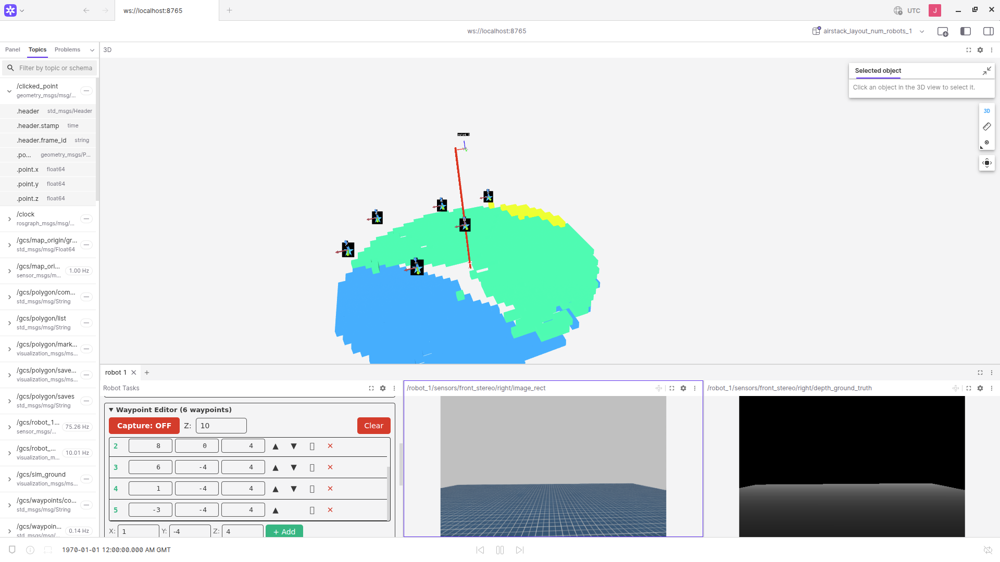
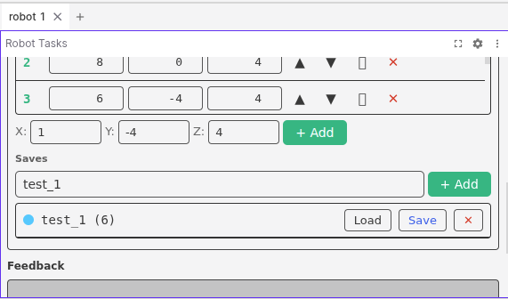

# Autonomous Navigation

This guide covers commanding a drone to fly a path by **adding waypoints** in the
Foxglove visualizer, **saving** them so they survive a relaunch, and sending them as
a `navigate` task. It assumes a live stack is up and connected in Foxglove (see
[Operation](operation.md) for the connection walkthrough).

Waypoints are placed and edited entirely in the visualizer — there is no separate
command line step. The **Waypoint Editor** panel maintains the active list, and a
collector node on the GCS turns your clicks into a `nav_msgs/Path` that the
`navigate` task follows.

---

## Adding Waypoints



The Waypoint Editor panel header shows the active count (e.g. `Waypoint Editor (4 waypoints)`)
and two controls: a **Capture** toggle and a **Clear** button. Below them is the
editable waypoint table; the matching markers and connecting path appear in the 3D view.

### Capturing clicks from the 3D view

The **Capture** button is the on/off switch for turning 3D-view clicks into waypoints:

- **Capture: ON** (green) — each point you publish in the 3D view is appended to the list.
- **Capture: OFF** (red) — clicks are ignored, so you can pan and orbit the scene
  without dropping stray waypoints.

To drop a waypoint by clicking:

1. Set **Capture: ON**.
2. In the 3D panel toolbar, select the **Publish point** tool and confirm its topic is
   `/clicked_point` (`geometry_msgs/PointStamped`).
3. Click on the scene. Each click adds one waypoint to the table and redraws the path.

> **Only one editor captures at a time.** The Waypoint Editor and Polygon Editor share
> the same `/clicked_point` topic. If clicks aren't landing where you expect, make sure
> the *other* editor's Capture is OFF.

A click only sets **X** and **Y** (it lands on the ground plane). Set the height with
the per-row **Z** value or the panel's altitude control.

### Adding waypoints manually

You don't have to click. The table accepts typed coordinates: enter **X**, **Y**, **Z**
and press **+ Add** to append an exact waypoint. This is the reliable way to enter
precise positions (the placed `test_1` route, for example, holds every waypoint at `z = 4`).

### Editing the list

Each row has controls to **reorder** (▲ / ▼), **set altitude**, and **delete** (✕) that
waypoint. **Clear** empties the whole active list. Edits update the published path live.

---

## Saving Waypoints



There are **two distinct save steps**, and only the second one writes to disk. This is
the most common source of "I lost my route after relaunch."

| Step | Button | What it does | Survives relaunch? |
|------|--------|--------------|--------------------|
| Snapshot the active list under a name | **+ Add** (in the *Saves* section) | Stores the route **in memory** on the GCS | ❌ No |
| Persist that named save | **Save** (on the save's row) | Writes the save **to disk** | ✅ Yes |

So the workflow is:

1. Build the active list (click or manual **+ Add** in the table).
2. In the **Saves** section, type a name (e.g. `test_1`) and press **+ Add**. A row
   appears, e.g. `● test_1 (6)` — the `(6)` is the waypoint count, and the colored dot
   is its auto-assigned palette color.
3. Press **Save** on that row to persist it to disk.

The row also offers **Load** (replace the active list with this save) and **✕** (delete
the save).

### Where saves are stored

Persisted saves are written to a single JSON file:

- **Inside the GCS container:** `~/.airstack/gcs_waypoint_saves.json`
- **On the host:** `AirStack/gcs/saves/gcs_waypoint_saves.json`

These are the same file — the GCS container mounts the host `gcs/saves/` directory at
`/root/.airstack` (read-write), so anything you **Save** persists across
`airstack down` / `airstack up`, container rebuilds, and reboots. On startup the
collector node reloads this file, so your named routes reappear automatically.

The file is plain JSON — each save records its color and vertices:

```json
{
  "test_1": {
    "color": [0.2, 0.8, 1.0],
    "vertices": [
      { "x": 0.0, "y": 0.0, "z": 4.0 },
      { "x": 4.0, "y": 4.0, "z": 4.0 },
      { "x": 8.0, "y": 0.0, "z": 4.0 }
    ]
  }
}
```

> **Ownership note.** The container writes as `root`, so the host file is root-owned.
> To read, edit, or delete it from the host you'll need `sudo` (e.g. `sudo cat
> AirStack/gcs/saves/gcs_waypoint_saves.json`). The visualizer's own Load / ✕ buttons
> work without sudo.

---

## Flying the Path

### Loading a saved route into the Navigate task

The **Robot Tasks** panel doesn't read your active editor list automatically — you pick
which route to fly and pull it in:

1. In the **Robot Tasks** panel, open the **Navigate** tab. It has a **waypoints** box
   (a JSON array of `[x, y, z]` points).
2. Click the **`from:`** dropdown above that box and select your saved list — in this
   example, **`test_1`**. (The dropdown also has an **`active`** option, which grabs the
   editor's current live list instead of a named save.)
3. Click **Grab**. The saved waypoints are copied into the **waypoints** box.


> If `test_1` isn't in the dropdown, it was never persisted — go back and press **Save**
> on its row in the Waypoint Editor (a name added only with **+ Add** stays in memory and
> won't appear here after a relaunch).

### Sending the goal

Once the waypoints box is filled, send it as a `navigate` task:

- The active waypoints are published as a `nav_msgs/Path` on `/gcs/waypoints/path`
  (in the global `map` frame).
- The **Robot Tasks** panel sends this path to `/{robot}/tasks/navigate/goal`, where the
  `action_relay` node forwards it to the on-robot navigate action and the local planner
  follows it.

The drone must already be **airborne (≥ 5 m AGL)** — `action_relay` rejects every
non-takeoff task below that. Take off first (Robot Tasks → `takeoff`), then send the
navigate goal. For the full task and topic reference, see
[Operation → Commanding the Drone / Waypoints & Tasks](operation.md).

---

## Quick Reference

| I want to… | Do this |
|------------|---------|
| Drop a waypoint by clicking | Capture: ON → Publish-point tool → click the 3D view |
| Enter an exact waypoint | Type X / Y / Z → **+ Add** in the table |
| Stop accidental waypoints | Capture: OFF |
| Name the current route | *Saves* → type name → **+ Add** (in memory only) |
| Keep a route across relaunch | Press **Save** on the saved row (writes to disk) |
| Reuse a saved route in the editor | Press **Load** on its row |
| Load a saved route into Navigate | Robot Tasks → Navigate → **`from:`** dropdown → pick `test_1` → **Grab** |
| Find the saved file | `AirStack/gcs/saves/gcs_waypoint_saves.json` (host, root-owned) |
| Fly the path | Take off (≥ 5 m), then send `navigate` from Robot Tasks |
