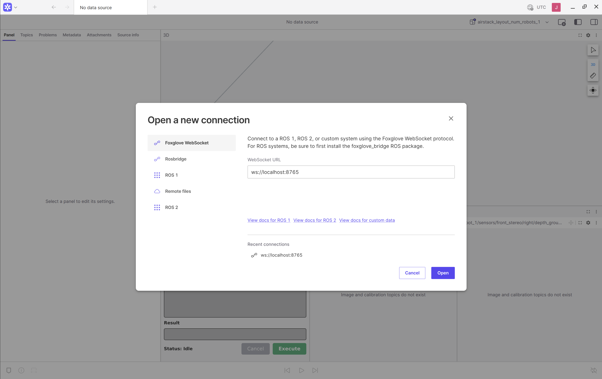
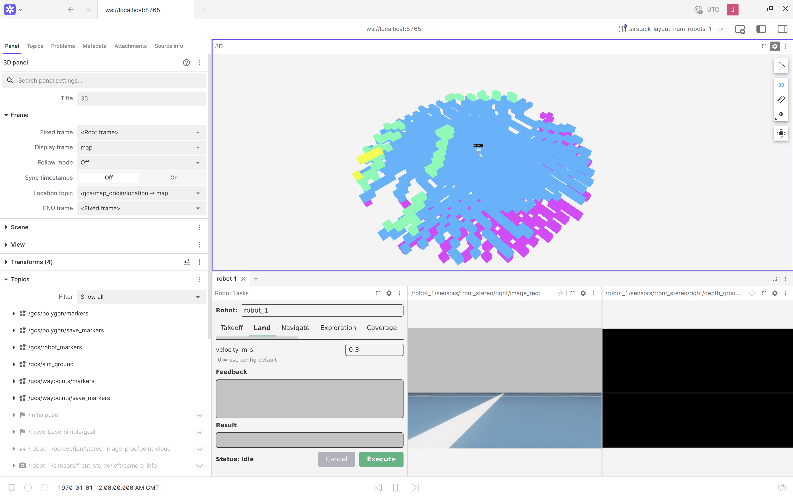
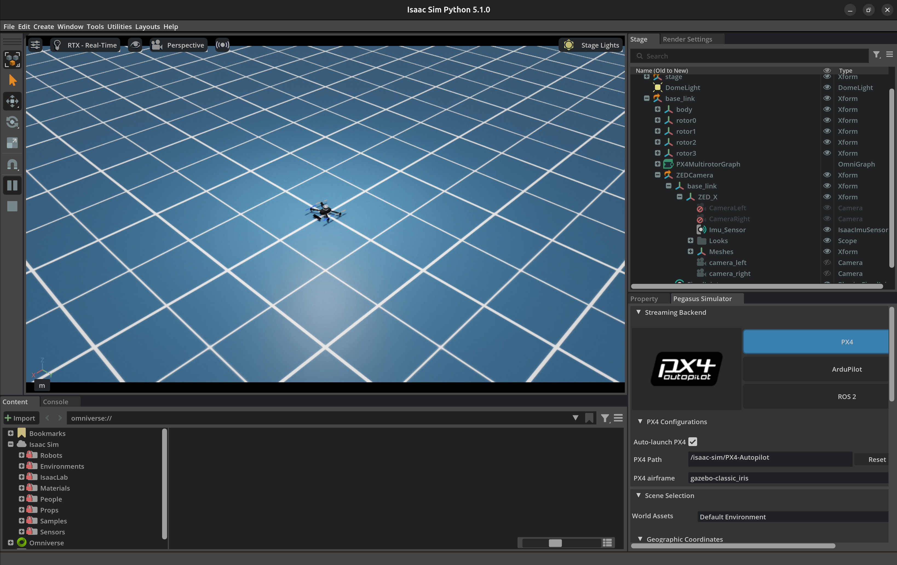

# Operation

> Paths are relative to the **AirStack repo root** (e.g. `~/AirStack`), not this docs repo.

[← Docs index](README.md) · [Getting Started](getting-started.md) · [Architecture](architecture.md) · [Configuration](configuration.md)

**In this guide**
1. [Open the visualizer (Foxglove)](#1-open-the-visualizer-foxglove)
2. [Set waypoints & run Navigate (Foxglove)](#2-set-waypoints--run-navigate-foxglove)
3. [Visualize in RViz — point cloud & TF](#3-visualize-in-rviz--point-cloud--tf)
4. [Reset Isaac Sim without a full restart](#4-reset-isaac-sim-without-a-full-restart)
5. [Find & inspect ROS 2 topics (DDS domains)](#5-find--inspect-ros-2-topics-dds-domains)
6. [Topic reference](#6-topic-reference)

---

## 1. Open the visualizer (Foxglove)

AirStack uses **Foxglove Studio** as its visualizer (not RViz). After `airstack up`, a Foxglove window opens with no layout and no connection. Load the layout, then connect.

> Foxglove needs a free login. Sign up at <https://app.foxglove.dev/signup> first.

**Load the layout**
1. Top-left icon (Foxglove menu) → **Layouts** → **+ Add** → **Import Personal Layout**.
2. Select **`airstack_layout_num_robots_1.json`** (use `_num_robots_<N>` for N robots). It's regenerated in the GCS container at `/root/` on every startup.

**Connect**
3. Top-left icon → **Open connection** → **Foxglove WebSocket**.
4. Set the address and click **Open**:
   - `ws://localhost:8765` — Foxglove **inside** the GCS container.
   - `ws://localhost:8766` — Foxglove on the **host**.

   

You should now see the drone and live data:



**Refresh** after a sim restart: re-open the connection, or hard-reload with **`Ctrl+R`** (layout is preserved).

---

## 2. Set waypoints & run Navigate (Foxglove)

Drop waypoints in the 3D view, build a path, then send it as a `navigate` task. All in Foxglove.


**1 — Take off first.** Non-takeoff tasks are rejected below **5 m AGL**. Robot Tasks panel → `takeoff`.

**2 — Drop waypoints.** In the **Waypoint Editor** panel:
- Click **Capture: ON** (green). This is the switch that turns 3D-view clicks into waypoints — the Waypoint and Polygon editors share `/clicked_point`, so only one should have Capture on at a time.
- In the 3D panel toolbar, pick the **Publish point** tool (topic `/clicked_point`) and click the scene. Each click adds a waypoint.
- Or type **X / Y / Z** and press **+ Add** for exact positions. (Clicks set X/Y on the ground plane; set height with **Z** / the altitude control.)
- Reorder (▲/▼), delete (✕), or **Clear** rows as needed.
- Click **Capture: OFF** when done so stray clicks don't add points.

**3 — Save the route (optional, two steps).**


| Step | Button | Result |
|---|---|---|
| Name the current list | **+ Add** (Saves section) | Saved **in memory** — lost on relaunch |
| Persist it | **Save** (on the save's row) | Written to **disk** — survives restart |

> Disk file: `AirStack/gcs/saves/gcs_waypoint_saves.json` (host) = `~/.airstack/gcs_waypoint_saves.json` (GCS container, mounted volume). Reloaded on startup. Root-owned — use `sudo` to edit from the host.

**4 — Send the Navigate goal.** Robot Tasks panel → **Navigate** tab:
- Open the **`from:`** dropdown, pick your saved route (or **`active`** for the live list).
- Click **Grab** → the waypoints fill the **waypoints** box.
- Send the goal. The path publishes on `/gcs/waypoints/path` → `/robot_1/tasks/navigate/goal`.

> **How Navigate uses the path:** the goal is the **last** waypoint; intermediate waypoints are soft guidance for the local planner, not hard stops. Expect it to head to the end while loosely following the line — not strict waypoint-by-waypoint. Drone must stay airborne ≥ 5 m AGL.

---

## 3. Visualize in RViz — point cloud & TF

Foxglove is the default, but you can use **RViz** to inspect a specific drone's **point cloud** and **TF tree**. The key: RViz must be on the **same `ROS_DOMAIN_ID` as the drone** (robot N → domain N), or you won't see its robot-only topics and full TF.

**On the host** (needs ROS 2 Jazzy installed + a display):

```bash
source /opt/ros/jazzy/setup.bash
export ROS_DOMAIN_ID=1     # robot_1 → 1, robot_2 → 2, robot N → N
rviz2
```

Then in RViz:
1. **Global Options → Fixed Frame:** `map`.
2. **Add → TF** — shows the drone's frames (`map`, `base_link`, sensor mounts).
3. **Add → PointCloud2**, set **Topic** to one of:
   - `/robot_1/sensors/ouster/point_cloud` — Ouster LiDAR cloud
   - `/robot_1/perception/stereo_image_proc/point_cloud` — stereo-derived cloud

**No ROS 2 on the host?** Run RViz inside the robot container (already on domain N, env guaranteed):

```bash
docker exec -it airstack-robot-desktop-1 bash -lc \
  'source /root/AirStack/robot/ros_ws/install/setup.bash && rviz2'
```

> Forgetting `ROS_DOMAIN_ID` is the usual reason RViz shows an empty TF tree or no cloud. Multi-robot: match the number — `ROS_DOMAIN_ID=2` for `robot_2`. See [§5](#5-find--inspect-ros-2-topics-dds-domains).

---

## 4. Reset Isaac Sim without a full restart

A healthy sim with the drone spawned:



If only the simulator misbehaves (e.g. PX4 died), reset from lightest to heaviest:

**Option 1 — Stop → Play in the Isaac Sim GUI (lightest).** PX4's lifecycle follows the sim timeline: **Stop** kills the stale PX4, **Play** re-inits the link and **auto-relaunches PX4**. Try this first.

**Option 2 — Restart the Isaac Sim container.**
```bash
docker restart isaac-sim
```
With `AUTOLAUNCH="true"`, this respawns PX4; MAVROS reconnects. Robot and GCS containers keep running.

**Option 3 — Full clean restart (most reliable).**
```bash
cd AirStack && airstack down && airstack up
```

> There is **no "restart PX4 only"** command, and the Pegasus MAVLink backend has no auto-reconnect — relaunching the PX4 binary by hand won't restore telemetry.

> A full restart is also currently the **only** way to clear accumulated EKF pose drift — see [Known issue: EKF pose drift over long sessions](#known-issue-ekf-pose-drift-over-long-sessions).

**Verify before commanding flight:**
```bash
# PX4 alive (running px4, not "<defunct>")
docker exec isaac-sim bash -lc 'pgrep -af px4'

# Odometry flowing (steady Hz)
docker exec airstack-robot-desktop-1 bash -lc \
  'source /root/AirStack/robot/ros_ws/install/setup.bash && \
   timeout 5 ros2 topic hz /robot_1/odometry_conversion/odometry'
```

---

## 5. Find & inspect ROS 2 topics (DDS domains)

Robot topics are namespaced `/{robot_name}` (e.g. `/robot_1`); GCS topics under `/gcs`. Each robot runs on its own `ROS_DOMAIN_ID`; the GCS bridges select per-robot topics across domains.

> **Frames:** each robot publishes autonomy data in its own local `map` frame (origin = takeoff position). The GCS georeferences these into one shared global ENU `map` frame using each robot's first GPS fix.

> **Missing a topic in `ros2 topic list`? You're almost always on the wrong domain — it exists, you just can't see it.** The single most common point of confusion.

**What `ROS_DOMAIN_ID` is.** ROS 2 nodes only see other nodes on the **same `ROS_DOMAIN_ID`** (integer 0–101, like a channel number). Unset = **0**. AirStack uses it to isolate robots:

| Who | Domain | Sees |
|---|---|---|
| Host terminal (default) | **0** | GCS domain + bridged topics |
| GCS container | **0** | GCS domain |
| `robot_N` container | **N** | All of robot N's topics |

A **DDS router** copies an allowlist of each robot's topics onto domain 0; everything else stays private to domain N. Allowlist: `robot/ros_ws/src/autonomy_bringup/onboard_all/config/dds_router.yaml`.

| Topic group | Domain | On host? |
|---|---|---|
| `/gcs/*`, `/clock`, `/tf_static` | 0 | ✅ |
| Bridged robot topics: `…/odometry_conversion/odometry`, `…/mavros/global_position/global`, `…/sensors/*`, `…/tasks/*`, `…/global_plan`, `…/vdb_mapping/*`, `…/trajectory_controller/trajectory_vis` | 0 ← N | ✅ |
| Robot-only: most `…/mavros/*` (`local_position/*`, `imu/data`, `estimator_status`, `state`, `battery`, …) | N | ❌ |

**Set your terminal's domain:**
```bash
ROS_DOMAIN_ID=1 ros2 topic list          # single command on domain 1
export ROS_DOMAIN_ID=1                    # whole session
export ROS_DOMAIN_ID=0                    # reset (or open a new terminal)
echo "ROS_DOMAIN_ID=${ROS_DOMAIN_ID:-0}"  # check current
```
> Needs ROS 2 sourced on the host (`source /opt/ros/jazzy/setup.bash`). If `ros2` isn't on the host, use the container instead.

**Three ways to view a robot-only topic:**
```bash
# (A) Use the BRIDGED equivalent from the host (no domain change):
ros2 topic echo /robot_1/odometry_conversion/odometry

# (B) Run inside the robot container (already on domain 1):
docker exec airstack-robot-desktop-1 bash -lc \
  'source /root/AirStack/robot/ros_ws/install/setup.bash; \
   ros2 topic echo /robot_1/interface/mavros/local_position/odom'

# (C) Switch your host terminal onto the robot's domain:
export ROS_DOMAIN_ID=1
ros2 topic echo /robot_1/interface/mavros/local_position/odom
export ROS_DOMAIN_ID=0
```
Use **(A)** when the bridged topic suffices, **(B)** as the most reliable, **(C)** to browse the robot's full list. Multi-robot: `ROS_DOMAIN_ID=2` for `robot_2`.

---

## 6. Topic reference

### 6.1 Pose & state estimation (onboard EKF)

Chain: **PX4 EKF2 → MAVROS → `odometry_conversion` → autonomy stack.** MAVROS publishes the EKF estimate (ENU, `map`→`base_link`) on `…/mavros/local_position/odom`; `odometry_conversion` republishes it as **`/{robot}/odometry_conversion/odometry`** — the canonical odometry every module consumes.

> ### Known issue: EKF pose drift over long sessions
>
> **Symptom.** When the sim runs for a long time, the drone's pose estimate drifts. The drift accumulates in the local planner (`droan_gl` stores absolute poses in the `map` frame), so over a session `navigate` paths get progressively erratic, take unnecessary detours, or get stuck — independent of which waypoints you set.
>
> **Why.** Nothing external corrects the PX4 EKF in the default sim setup: GPS is fused but noisy, `macvo`/vision is **not** fused, and the Isaac ground-truth pose (`/robot_1/state/pose`) is published but **unused**. So the stack runs purely on the onboard EKF, which drifts — and the planner never re-registers its stored poses.
>
> **Workaround (the only reliable clear).** Restart the stack:
> ```bash
> cd AirStack && airstack down && airstack up
> ```
> This resets the EKF and clears the planner's pose graph. Lighter resets do **not** help: `droan/reset_stuck` and `droan/clear_map` only clear the rewind history, not the accumulated obstacle graph (the `clear_map` graph-clear is an unimplemented `TODO`).
>
> **Status.** Open issue on the AirStack `main` branch (Release 0.18.0). **Awaiting further updates from CMU** on the intended fix (e.g. a ground-truth pose source in sim, fusing `macvo`, or a LiDAR SLAM). This note will be updated when they respond.

> **Raw vs converted odom:** same EKF estimate, identical numbers. `odometry_conversion` only (1) upgrades QoS BEST_EFFORT→RELIABLE, and (2) broadcasts TF (`map→base_link`). Covariance is **all zeros on both** — PX4 doesn't fill it here.

> **Visibility:** **Host** = bridged to domain 0 (in your laptop's `ros2 topic list`). **Robot only** = lives on domain N, not bridged (see [§5](#5-find--inspect-ros-2-topics-dds-domains)).

| Topic | Type | Purpose | Visibility |
|---|---|---|---|
| `/{robot}/interface/mavros/local_position/odom` | `nav_msgs/Odometry` | PX4 EKF pose+twist (raw MAVROS, BEST_EFFORT) | Robot only |
| `/{robot}/interface/mavros/local_position/pose` | `geometry_msgs/PoseStamped` | EKF pose only | Robot only |
| `/{robot}/odometry_conversion/odometry` | `nav_msgs/Odometry` | **Canonical odometry** (RELIABLE, broadcast to TF) | Host |
| `/{robot}/interface/mavros/imu/data` | `sensor_msgs/Imu` | FCU IMU (orientation, ang. vel, lin. accel) | Robot only |
| `/{robot}/interface/mavros/estimator_status` | `mavros_msgs/EstimatorStatus` | EKF health/validity flags | Robot only |
| `/{robot}/interface/mavros/global_position/global` | `sensor_msgs/NavSatFix` | GPS (lat/lon/alt); first fix = ENU boot origin | Host |
| `/{robot}/interface/mavros/altitude` | `mavros_msgs/Altitude` | AMSL / relative / terrain altitude | Robot only |
| `/{robot}/interface/mavros/state` | `mavros_msgs/State` | Connection/armed/mode (e.g. OFFBOARD) | Robot only |
| `/{robot}/interface/mavros/extended_state` | `mavros_msgs/ExtendedState` | Landed state (ON_GROUND/IN_AIR) | Robot only |
| `/{robot}/interface/mavros/battery` | `sensor_msgs/BatteryState` | Battery voltage/percentage | Robot only |
| `/{robot}/behavior/drone_safety_monitor/state_estimate_timed_out` | `std_msgs/Bool` | Watchdog: odometry timed out → auto-pauses controller | Robot only |

### 6.2 Commanding the drone — waypoints & tasks

High-level commands are **ROS 2 actions** under `/{robot}/tasks/{task}`. Foxglove can't call nested action services, so panels publish a JSON `std_msgs/String` on `…/goal`; `action_relay` parses it into the typed Goal, forwards to the robot, and streams `…/relay_feedback` / `…/relay_result` back. The relay also converts global-ENU editor coords into the robot's local `map` frame and rejects non-takeoff tasks below 5 m AGL.

Tasks: `takeoff`, `land`, `navigate`, `exploration`, `semantic_search`, `fixed_trajectory`.

| Topic | Type | Purpose |
|---|---|---|
| `/{robot}/tasks/{task}/goal` | `std_msgs/String` (JSON) | Send a task goal |
| `/{robot}/tasks/{task}/cancel` | `std_msgs/String` | Cancel the active task |
| `/{robot}/tasks/{task}/relay_feedback` | `std_msgs/String` (JSON) | Live feedback |
| `/{robot}/tasks/{task}/relay_result` | `std_msgs/String` (JSON) | Final `{success, message}` (also rejections) |
| `/{robot}/tasks/{task}` (action) | `task_msgs/action/{Task}Task` | On-robot action server |
| `/{robot}/global_plan` | `nav_msgs/Path` | Global path the local planner follows |

**Goal fields:**

| Task | Key fields |
|---|---|
| `takeoff` | `target_altitude_m` (>0), `velocity_m_s` (0 = config default) |
| `land` | `velocity_m_s` (0 = config default) |
| `navigate` | `global_plan` (`nav_msgs/Path`), `goal_tolerance_m` (default 1.0) |
| `exploration` | `search_bounds` (`Polygon`, empty = unbounded), `min/max_altitude_agl`, `min/max_flight_speed`, `time_limit_sec` |
| `semantic_search` | `query`, `background_queries`, `search_area` (`Polygon`), `min/max_altitude_agl`, `min/max_flight_speed`, `confidence_threshold` (0.95) |
| `fixed_trajectory` | `trajectory_spec` (`airstack_msgs/FixedTrajectory`), `loop` (bool) |

**Waypoint & polygon editors** — click-to-place panels publish `/clicked_point`; collector nodes keep editable lists, saves, and markers. The waypoint editor's `…/path` is the `nav_msgs/Path` you wire into `navigate`; polygon vertices feed `exploration`/`semantic_search`. (See [§2](#2-set-waypoints--run-navigate-foxglove) for the workflow.)

| Topic | Type | Purpose |
|---|---|---|
| `/clicked_point` | `geometry_msgs/PointStamped` | 3D-panel click → waypoint/vertex (shared; gated by Capture) |
| `/gcs/waypoints/command` | `std_msgs/String` (JSON) | Edit verbs: add/delete/move/reorder/clear/set_altitude/saves |
| `/gcs/waypoints/list` | `std_msgs/String` (JSON) | Active list (latched) |
| `/gcs/waypoints/path` | `nav_msgs/Path` | Active path in global `map` (latched) — use as `navigate` `global_plan` |
| `/gcs/waypoints/markers` | `visualization_msgs/MarkerArray` | Active waypoint markers (latched) |
| `/gcs/waypoints/save_markers` | `visualization_msgs/MarkerArray` | All saved routes, per-color (latched) |
| `/gcs/waypoints/saves` | `std_msgs/String` (JSON) | Saved-route metadata (latched) |
| `/gcs/polygon/*` | (same shape as waypoints) | Polygon edit/list/markers/saves |

### 6.3 GCS visualization

`foxglove_visualizer_node` auto-discovers each robot's topics, georeferences them into the shared global ENU `map` frame, and merges into one MarkerArray.

| Topic | Type | Purpose |
|---|---|---|
| `/gcs/robot_markers` | `visualization_msgs/MarkerArray` | Merged per-robot markers (mesh, label, axes, trajectory, plan, VDB) |
| `/gcs/{robot}/location` | `sensor_msgs/NavSatFix` | Per-robot GPS in `map` frame (Map-panel pin) |
| `/gcs/map_origin/location` | `sensor_msgs/NavSatFix` | Fixed reference at `ORIGIN_LAT/LON` (1 Hz) |
| `/gcs/map_origin/ground_msl` | `std_msgs/Float64` | MSL of map `z=0` (latched) |
| `/gcs/sim_ground` | `visualization_msgs/Marker` | Sim overhead image as textured ground (sim only, latched) |

### 6.4 Sensors & perception

Raw under `/{robot}/sensors/…`, processed under `/{robot}/perception/…`. Image/cloud topics use SENSOR_QOS (BEST_EFFORT).

| Topic | Type | Purpose |
|---|---|---|
| `/{robot}/sensors/front_stereo/left/image_rect` | `sensor_msgs/Image` | Rectified left stereo |
| `/{robot}/sensors/front_stereo/left/camera_info` | `sensor_msgs/CameraInfo` | Left intrinsics |
| `/{robot}/sensors/front_stereo/right/image_rect` | `sensor_msgs/Image` | Rectified right stereo |
| `/{robot}/sensors/front_stereo/right/camera_info` | `sensor_msgs/CameraInfo` | Right intrinsics |
| `/{robot}/sensors/front_stereo/right/depth_ground_truth` | `sensor_msgs/Image` | Ground-truth depth (sim only) |
| `/{robot}/sensors/ouster/point_cloud` | `sensor_msgs/PointCloud2` | Ouster LiDAR cloud (feeds VDB mapping) |
| `/{robot}/perception/stereo_image_proc/point_cloud` | `sensor_msgs/PointCloud2` | Stereo-disparity cloud |

### 6.5 Mapping & plans

| Topic | Type | Purpose |
|---|---|---|
| `/{robot}/vdb_mapping/vdb_map_visualization` | `visualization_msgs/Marker` | VDB occupancy map mesh (height-colored) |
| `/{robot}/trajectory_controller/trajectory_vis` | `visualization_msgs/MarkerArray` | Trajectory currently executing |
| `/{robot}/global_plan` | `nav_msgs/Path` | Global path the robot is following |

### 6.6 Common / infrastructure

| Topic | Type | Purpose |
|---|---|---|
| `/clock` | `rosgraph_msgs/Clock` | Sim time (`use_sim_time`) |
| `/tf_static` | `tf2_msgs/TFMessage` | Static transforms; dynamic `/tf` from `odometry_conversion` |
| `/rosout` | `rcl_interfaces/Log` | Node logging |
| `/parameter_events` | `rcl_interfaces/ParameterEvent` | Param changes |
| `/gossip/peers` | custom | Multi-robot peer discovery |

> **Quick reference**
> - **Drone pose:** `/{robot}/odometry_conversion/odometry` (canonical); raw = `…/mavros/local_position/odom`.
> - **EKF health:** `/{robot}/interface/mavros/estimator_status`.
> - **Waypoints → fly:** build path in the Foxglove waypoint editor → **Grab** into Navigate → send (see [§2](#2-set-waypoints--run-navigate-foxglove)).
> - **RViz cloud/TF:** `export ROS_DOMAIN_ID=N` then `rviz2` (see [§3](#3-visualize-in-rviz--point-cloud--tf)).
